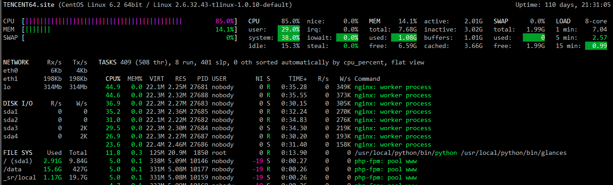
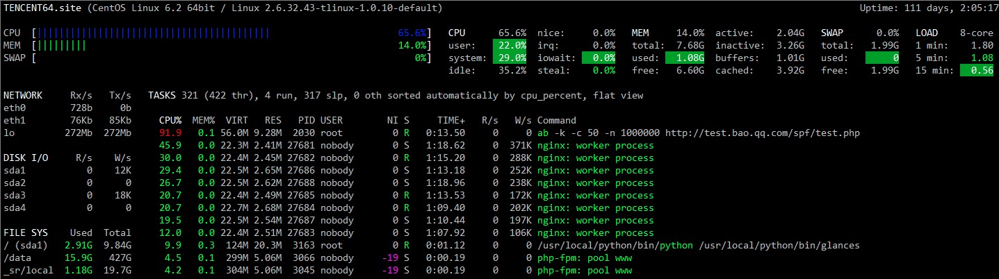
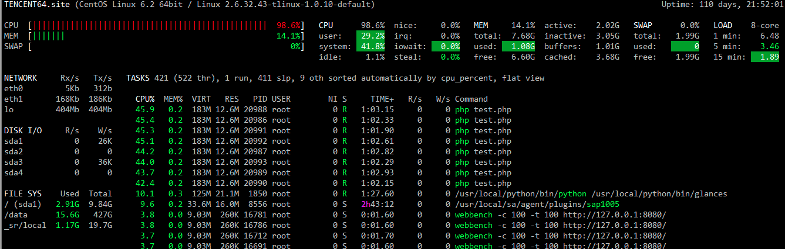
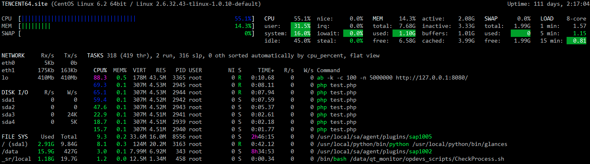
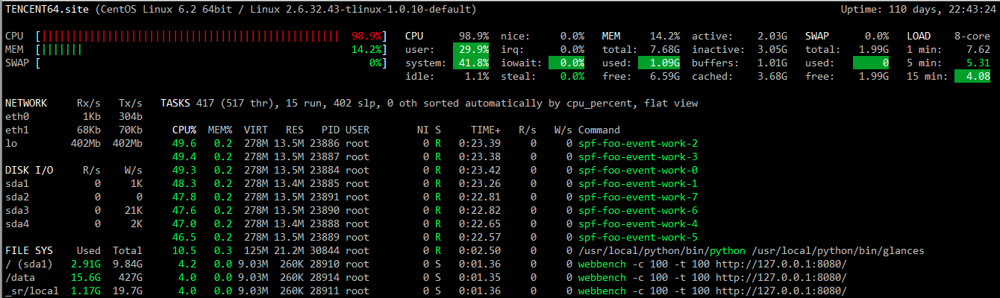
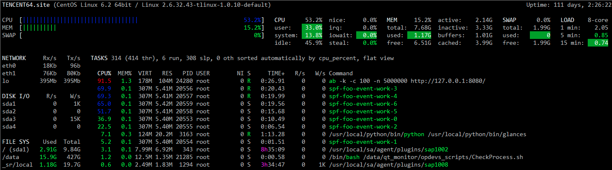
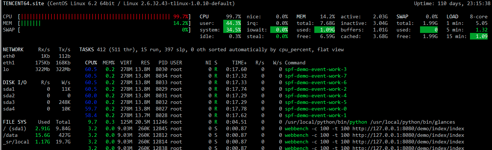
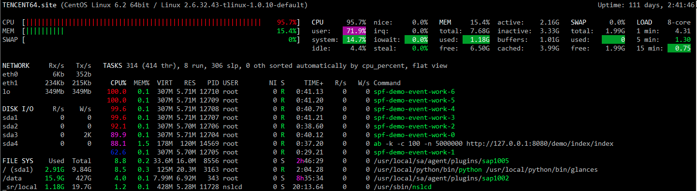

# spf性能测试

## 1 概述

使用webbench工具对nginx/php-fpm，swoole 原生http，spf http，spf-http-mvc-demo进行压力测试。


## 2 测试环境

### 2.1 硬件配置

- CPU: Intel(R) Xeon(R) CPU X3440  @ 2.53GHz x8
- 内存：8G
- 磁盘：Seagate Constellation ES ST3500514NS 500G ATA
- 网卡： Intel Corporation 82576 Gigabit Network Connection x2
- 操作系统：Tencent tlinux release 1.2 (Final) 2.6.32.43-tlinux-1.0.10-default (kbuild@tlinux12) (gcc version 4.4.6 20110731 (Red Hat 4.4.6-3) (GCC) )

### 2.2 linux内核参数

/etc/security/limits.conf

``` 
* soft nofile 262140
* hard nofile 262140
* soft core unlimited
* hard core unlimited
```

/etc/sysctl.conf

``` 
net.unix.max_dgram_qlen = 100
net.ipv4.tcp_mem  =   379008       505344  758016
net.ipv4.tcp_wmem = 4096        16384   4194304
net.ipv4.tcp_rmem = 4096          87380   4194304
net.core.wmem_default = 8388608
net.core.rmem_default = 8388608
net.core.rmem_max = 16777216
net.core.wmem_max = 16777216
net.ipv4.tcp_tw_reuse = 1
net.ipv4.tcp_tw_recycle = 1
kernel.msgmnb = 4203520
kernel.msgmni = 64
kernel.msgmax = 8192
net.ipv4.tcp_syncookies=1
net.ipv4.tcp_max_syn_backlog=81920
net.ipv4.tcp_synack_retries=3
net.ipv4.tcp_syn_retries=3
net.ipv4.tcp_fin_timeout = 30
net.ipv4.tcp_keepalive_time = 300
net.ipv4.tcp_tw_reuse = 1
net.ipv4.tcp_tw_recycle = 1
net.ipv4.ip_local_port_range = 20000 65000
net.ipv4.tcp_max_tw_buckets = 200000
net.ipv4.route.max_size = 5242880
```

### 2.3 压测工具

``` shell
webbench -c 100 -t 100 http://127.0.0.1:8080/
ab -c 100 -t 100 -k http://127.0.0.1:8080/ 
```

### 2.4 软件信息

#### 2.4.1 nginx+php

版本 nginx/1.8.1，php7.0.8+opcache

VHOST配置

``` javascript
server {
    listen 80 default_server;
    root /data/webroot;
    index index.html index.htm index.php;
    location / {
    	try_files $uri $uri/ /index.php?uri=$uri;
    }
    location ~ ^.*\.php {
        root /usr/local/baoweb;
        fastcgi_pass   127.0.0.1:9100;
        include "fastcgi.conf";
        fastcgi_index  index.php;
    }
}
```

测试页面index.php

``` php
<?php
    echo "Hello World!";
```

进程数量

Nginx开启了4个Worker进程

php-fpm 最小50进程，最大2000进程

#### 2.4.2 swoole原生

测试代码

``` php
<?php
$http = new swoole_http_server("0.0.0.0", 8080, SWOOLE_BASE);
$http->set([
    'worker_num'  => 8,
]);

$http->on('request', function ($request, swoole_http_response $response) {
    $response->header('Last-Modified', 'Tue, 26 Jul 2016 10:24:27 GMT');
    $response->header('E-Tag', '55829c5b-17');
    $response->header('Accept-Ranges', 'bytes');    
    $response->end("<h1>\nHello World.\n</h1>");
});

$http->start();
```

#### 2.4.3 spf http

代码如下：

``` php
<?php
namespace demo\spf;
use spf\Swoole\Worker\Base;
use spf\Swoole\Worker\IWorker;
class DemoWorker extends Base implements IWorker 
{
   public function onRequest(\swoole_http_request $request = null, \swoole_http_response $response = null) {
      $response->header('Last-Modified', 'Tue, 26 Jul 2016 10:24:27 GMT');
      $response->header('E-Tag', '55829c5b-17');
      $response->header('Accept-Ranges', 'bytes');    
      $response->end("<h1>\nHello World.\n</h1>");    
   }
}
```

复制spf/conf/demo.php为foo.php，修改其中的`worker_class`为上面创建的类名：`\demo\spf\DemoWorker`，启用服务使用spf命令`spf start foo`。

#### 2.4.4 spf mvc demo

使用spf源码中提供的简化版mvc demo代码进行压测，代码省略。启用服务使用spf命令`spf start demo`。

``` php
<?php
namespace demo\controller;
use syb\oss\Controller;
class index extends Controller {
    function actionIndex() {
        $response = $this->response;
        $response->header('Last-Modified', 'Tue, 26 Jul 2016 10:24:27 GMT');
        $response->header('E-Tag', '55829c5b-17');
        $response->header('Accept-Ranges', 'bytes');
        $response->end("<h1>\nHello World.\n</h1>");
    }
}
```

## 3 测试结果

### 3.1 nginx+php-fpm

#### 3.1.1 webbench

``` 
webbench -c 100 -t 100 http://test.bao.qq.com/spf/test.php

Webbench - Simple Web Benchmark 1.5
Copyright (c) Radim Kolar 1997-2004, GPL Open Source Software.

Benchmarking: GET http://test.bao.qq.com/spf/test.php
100 clients, running 100 sec.

Speed=1226627 pages/min, 3414113 bytes/sec.
Requests: 2044379 susceed, 0 failed.
Requests per second:    20443.79 [#/sec] (mean)
```



#### 3.1.2 ab

``` 
ab -k -c 50 -n 1000000 http://test.bao.qq.com/spf/test.php
Concurrency Level:      50
Time taken for tests:   58.951 seconds
Complete requests:      1000000
Failed requests:        0
Keep-Alive requests:    0
Total transferred:      167000000 bytes
HTML transferred:       12000000 bytes
Requests per second:    16963.24 [#/sec] (mean)
Time per request:       2.948 [ms] (mean)
Time per request:       0.059 [ms] (mean, across all concurrent requests)
Transfer rate:          2766.47 [Kbytes/sec] received

Connection Times (ms)
              min  mean[+/-sd] median   max
Connect:        0    0   0.3      0       8
Processing:     0    3   0.9      3      18
Waiting:        0    3   0.9      2      18
Total:          0    3   0.8      3      19
WARNING: The median and mean for the waiting time are not within a normal deviation
        These results are probably not that reliable.
Percentage of the requests served within a certain time (ms)
  50%      3
  66%      3
  75%      3
  80%      3
  90%      4
  95%      4
  98%      5
  99%      6
 100%     19 (longest request) 
```



### 3.2 swoole原生

#### 3.2.1 webbench

``` 
webbench -c 100 -t 100 http://127.0.0.1:8080/
Webbench - Simple Web Benchmark 1.5
Copyright (c) Radim Kolar 1997-2004, GPL Open Source Software.

Benchmarking: GET http://127.0.0.1:8080/
100 clients, running 100 sec.

Speed=3737880 pages/min, 16135182 bytes/sec.
Requests: 6229801 susceed, 0 failed.
Requests per second:    62298.01 [#/sec] (mean)
```



#### 3.2.2 ab

``` 
ab -k -c 100 -n 5000000 http://127.0.0.1:8080/
Concurrency Level:      100
Time taken for tests:   44.556 seconds
Complete requests:      5000000
Failed requests:        0
Keep-Alive requests:    5000000
Total transferred:      1320000000 bytes
HTML transferred:       115000000 bytes
Requests per second:    112218.85 [#/sec] (mean)
Time per request:       0.891 [ms] (mean)
Time per request:       0.009 [ms] (mean, across all concurrent requests)
Transfer rate:          28931.42 [Kbytes/sec] received

Connection Times (ms)
              min  mean[+/-sd] median   max
Connect:        0    0   0.0      0       3
Processing:     0    1   0.4      1      26
Waiting:        0    1   0.4      1      26
Total:          0    1   0.4      1      26

Percentage of the requests served within a certain time (ms)
  50%      1
  66%      1
  75%      1
  80%      1
  90%      1
  95%      2
  98%      2
  99%      2
 100%     26 (longest request) 
```




### 3.3 spf http

#### 3.3.1 webbench

``` 
webbench -c 100 -t 100 http://127.0.0.1:8080/
Webbench - Simple Web Benchmark 1.5
Copyright (c) Radim Kolar 1997-2004, GPL Open Source Software.

Benchmarking: GET http://127.0.0.1:8080/
100 clients, running 100 sec.

Speed=3691755 pages/min, 15936083 bytes/sec.
Requests: 6152925 susceed, 0 failed.
Requests per second:    61529.25 [#/sec] (mean)
```



#### 3.3.2 ab

``` 
ab -k -c 100 -n 5000000 http://127.0.0.1:8080/
Concurrency Level:      100
Time taken for tests:   43.328 seconds
Complete requests:      5000000
Failed requests:        0
Keep-Alive requests:    5000000
Total transferred:      1320000000 bytes
HTML transferred:       115000000 bytes
Requests per second:    115398.47 [#/sec] (mean)
Time per request:       0.867 [ms] (mean)
Time per request:       0.009 [ms] (mean, across all concurrent requests)
Transfer rate:          29751.17 [Kbytes/sec] received

Connection Times (ms)
              min  mean[+/-sd] median   max
Connect:        0    0   0.0      0       3
Processing:     0    1   0.4      1      23
Waiting:        0    1   0.4      1      23
Total:          0    1   0.4      1      23

Percentage of the requests served within a certain time (ms)
  50%      1
  66%      1
  75%      1
  80%      1
  90%      1
  95%      1
  98%      2
  99%      2
 100%     23 (longest request)
```



### 3.4 spf mvc demo

#### 3.4.1 webbench

``` 
webbench -c 100 -t 100 http://127.0.0.1:8080/demo/index/index
Webbench - Simple Web Benchmark 1.5
Copyright (c) Radim Kolar 1997-2004, GPL Open Source Software.

Benchmarking: GET http://127.0.0.1:8080/demo/index/index
100 clients, running 100 sec.

Speed=2898611 pages/min, 12512344 bytes/sec.
Requests: 4831019 susceed, 0 failed.
Requests per second:    48310.19 [#/sec] (mean)
```



#### 3.4.2 ab

``` 
ab -k -c 100 -n 5000000 http://127.0.0.1:8080/demo/index/index

Document Path:          /demo/index/index
Document Length:        23 bytes

Concurrency Level:      100
Time taken for tests:   53.503 seconds
Complete requests:      5000000
Failed requests:        0
Keep-Alive requests:    5000000
Total transferred:      1320000000 bytes
HTML transferred:       115000000 bytes
Requests per second:    93453.19 [#/sec] (mean)
Time per request:       1.070 [ms] (mean)
Time per request:       0.011 [ms] (mean, across all concurrent requests)
Transfer rate:          24093.40 [Kbytes/sec] received

Connection Times (ms)
              min  mean[+/-sd] median   max
Connect:        0    0   0.0      0       5
Processing:     0    1   0.7      1      27
Waiting:        0    1   0.7      1      27
Total:          0    1   0.7      1      27

Percentage of the requests served within a certain time (ms)
  50%      1
  66%      1
  75%      1
  80%      1
  90%      2
  95%      2
  98%      2
  99%      3
 100%     27 (longest request)
```



## 4 总结

| 压力测试用例        | webbench性能QPS | ab性能QPS (KeepAlive) | 
| ------------- | ------------- | ------------------- | 
| nginx/php-fpm | 20443.79      | 16963.24            | 
| swoole 原生     | 62298.01      | 112218.85           | 
| spf http      | 61529.25      | 115398.47           | 
| spf mvc demo  | 48310.19      | 93453.19            | 

1. swoole原生场景与spf http场景中，因没有专门的压测服务器，未能充分发挥性能。以至于看起来性能相近。但在KeepAlive场景中可以看出，swoole原生的CPU消耗稍低，如果有专门的压测服务，性能肯定比spf http稍高。
2. KeepAlive支持后，性能提升明显。一方面，测试用的linux内核版本低于3.9.0，不能开启REUSEPORT选项，建立HTTP短连接需要较高的成本。另一方面，swoole官方压测也是采用KeepAlive方式。
3. 在增加spf mvc框架的压力测试场景中，因php执行的代码量增大，cpu使用率上升，性能下降到原生swoole的80%。在追求性能的业务场景中，尽量不要使用太重的PHP框架。