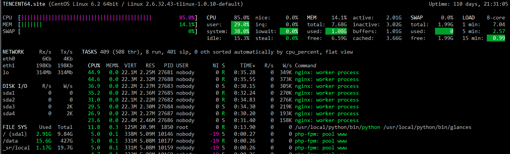
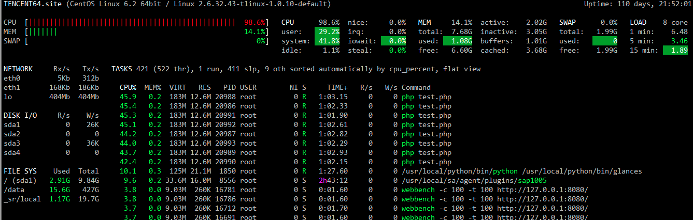
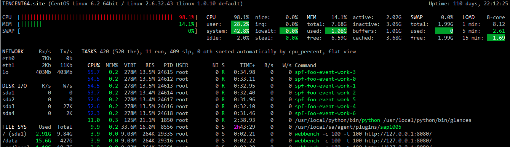
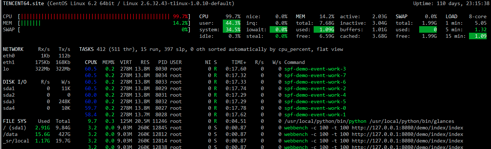

# spf性能
## 性能对比
使用webbench工具对nginx/php-fpm、swoole http、spf http、spf-http-mvc-demo进行压力测试。

| 软件 | QPS |
| -- | -- |
| nginx/php-fpm  | 20443.79 |
| swoole 原生    | 62298.01 |
| spf http       | 61900.49 |
| spf mvc demo   | 45203.97 |

## 测试环境

### 硬件配置

CPU: Intel(R) Xeon(R) CPU X3440  @ 2.53GHz x8
内存：8G
磁盘：Seagate Constellation ES ST3500514NS 500G ATA
网卡： Intel Corporation 82576 Gigabit Network Connection x2
操作系统：Tencent tlinux release 1.2 (Final) 2.6.32.43-tlinux-1.0.10-default (kbuild@tlinux12) (gcc version 4.4.6 20110731 (Red Hat 4.4.6-3) (GCC) )

### 压测工具

```shell
 webbench -c 50 -t 100 -k http://127.0.0.1:8080/
```
### 软件信息

#### nginx+php

版本 nginx/1.8.1、php7.0.8+opcache

VHOST配置
```javascript
server {
    listen 80 default_server;
    root /data/webroot;
    index index.html index.htm index.php;
    location / {
    	try_files $uri $uri/ /index.php?uri=$uri;
    }
    location ~ ^.*\.php {
        root /usr/local/baoweb;
        fastcgi_pass   127.0.0.1:9100;
        include "fastcgi.conf";
        fastcgi_index  index.php;
    }
}
```

测试页面index.php
```php
<?php
    echo "Hello World!";
```
进程数量
Nginx开启了4个Worker进程
php-fpm 最小50进程，最大2000进程

#### swoole原生
测试代码
```php
<?php
$http = new swoole_http_server("0.0.0.0", 8080, SWOOLE_BASE);
$http->set([
    'worker_num'  => 8,
]);

$http->on('request', function ($request, swoole_http_response $response) {
    $response->header('Last-Modified', 'Tue, 26 Jul 2016 10:24:27 GMT');
    $response->header('E-Tag', '55829c5b-17');
    $response->header('Accept-Ranges', 'bytes');    
    $response->end("<h1>\nHello World.\n</h1>");
});

$http->start();
```
#### spf http
代码如下：
```php
<?php
namespace demo\spf;
use spf\Swoole\Worker\Base;
use spf\Swoole\Worker\IWorker;
class DemoWorker extends Base implements IWorker 
{
   public function onRequest(\swoole_http_request $request = null, \swoole_http_response $response = null) {
      $response->header('Last-Modified', 'Tue, 26 Jul 2016 10:24:27 GMT');
      $response->header('E-Tag', '55829c5b-17');
      $response->header('Accept-Ranges', 'bytes');    
      $response->end("<h1>\nHello World.\n</h1>");    
   }
}
```
复制spf/conf/demo.php为foo.php，修改其中的`worker_class`为上面创建的类名：`\demo\spf\DemoWorker`，启用服务使用spf命令`spf start foo`。

#### spf mvc demo
使用spf源码中提供的简化版mvc demo代码进行压测，代码省略。启用服务使用spf命令`spf start demo`。
```php
<?php
namespace demo\controller;
use syb\oss\Controller;
class index extends Controller {
    function actionIndex() {
        $response = $this->response;
        $response->header('Last-Modified', 'Tue, 26 Jul 2016 10:24:27 GMT');
        $response->header('E-Tag', '55829c5b-17');
        $response->header('Accept-Ranges', 'bytes');
        $response->end("<h1>\nHello World.\n</h1>");
    }
}
```
## 测试结果
###nginx+php-fpm


```
webbench -c 100 -t 100 http://test.bao.qq.com/spf/test.php

Webbench - Simple Web Benchmark 1.5
Copyright (c) Radim Kolar 1997-2004, GPL Open Source Software.

Benchmarking: GET http://test.bao.qq.com/spf/test.php
100 clients, running 100 sec.

Speed=1226627 pages/min, 3414113 bytes/sec.
Requests: 2044379 susceed, 0 failed.
Requests per second:    20443.79 [#/sec] (mean)
```


###swoole原生
```
webbench -c 100 -t 100 http://127.0.0.1:8080/
Webbench - Simple Web Benchmark 1.5
Copyright (c) Radim Kolar 1997-2004, GPL Open Source Software.

Benchmarking: GET http://127.0.0.1:8080/
100 clients, running 100 sec.

Speed=3737880 pages/min, 16135182 bytes/sec.
Requests: 6229801 susceed, 0 failed.
Requests per second:    62298.01 [#/sec] (mean)
```

###spf http

```
webbench -c 100 -t 100 http://127.0.0.1:8080/
Webbench - Simple Web Benchmark 1.5
Copyright (c) Radim Kolar 1997-2004, GPL Open Source Software.

Benchmarking: GET http://127.0.0.1:8080/
100 clients, running 100 sec.

Speed=3714029 pages/min, 16032229 bytes/sec.
Requests: 6190049 susceed, 0 failed.
Requests per second:    61900.49 [#/sec] (mean)
```


###spf mvc demo
```
webbench -c 100 -t 100 http://127.0.0.1:8080/demo/index/index
Webbench - Simple Web Benchmark 1.5
Copyright (c) Radim Kolar 1997-2004, GPL Open Source Software.

Benchmarking: GET http://127.0.0.1:8080/demo/index/index
100 clients, running 100 sec.

Speed=2712238 pages/min, 11707828 bytes/sec.
Requests: 4520397 susceed, 0 failed.
Requests per second:    45203.97 [#/sec] (mean)
```

